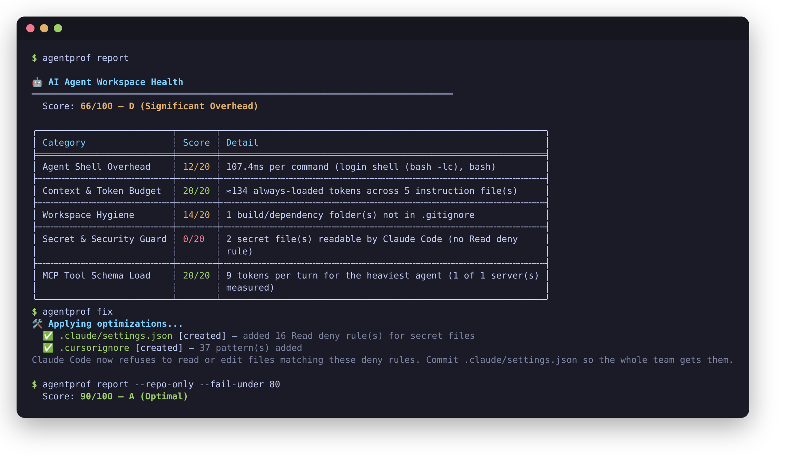

# agentprof

**See what your AI coding agent loads and runs — and fix it.**

[](https://github.com/dautovri/agentprof/actions/workflows/ci.yml)
[](https://github.com/dautovri/agentprof/releases/latest)
[](LICENSE)
[](Cargo.toml)

agentprof is a fast Rust CLI that inspects what coding agents — Claude Code,
Cursor, Codex, OpenCode, Gemini CLI, GitHub Copilot, Windsurf — actually load
and execute in your workspace:

- 🔐 **Secrets agents can read.** `.env` files, keys and credentials that no
  Claude Code `Read(...)` deny rule covers. (`.claudeignore` is *not* read by
  Claude Code — `agentprof fix` writes the deny rules that are.)
- 📚 **Always-loaded instructions.** What in `CLAUDE.md`, `AGENTS.md`,
  `.cursor/rules` and friends rides along on every turn, versus what loads
  only for matching files.
- 🔌 **MCP tool load per agent.** Real `tools/list` handshakes with each
  configured server, accounting for Claude Code's deferred tool loading.
- 🎯 **Skills.** Name and description tokens every session pays for,
  oversized `SKILL.md` files, and skills competing for the same intent.
- ⚔️ **Conflicting instructions** across agent files, with file and line.
- 🐚 **Per-command shell overhead.** Claude Code's shell-snapshot replay and
  login shells, timed on your machine.
- 🧾 **Session cost.** Claude Code transcripts, de-duplicated and priced per
  model.

Every figure is measured. Anything that cannot be measured is reported as
`—` or left out of the score, never guessed.



## Quick start

```bash
curl -fsSL https://raw.githubusercontent.com/dautovri/agentprof/main/install.sh | bash

agentprof scan              # everything, with prioritized recommendations
agentprof fix --dry-run     # preview: deny rules for secrets, .cursorignore
agentprof mcp --probe       # measure your MCP servers' real tool load
```

Want to try it on something disposable first?
`scripts/demo-workspace.sh /tmp/demo` builds a small workspace that trips
every check (the screenshot above comes from it).

## Install

**Prebuilt binary** (macOS arm64/x86_64, Linux x86_64/arm64). The script
downloads the release for your platform and verifies its SHA-256 before
installing; it builds from source only if no binary exists for your platform.

```bash
curl -fsSL https://raw.githubusercontent.com/dautovri/agentprof/main/install.sh | bash
# pin a version or location:
curl -fsSL https://raw.githubusercontent.com/dautovri/agentprof/main/install.sh \
  | AGENTPROF_VERSION=v0.3.0 AGENTPROF_INSTALL_DIR="$HOME/bin" bash
```

**Homebrew**

```bash
brew install dautovri/tap/agentprof
```

**From source** (Rust 1.88+)

```bash
cargo install --git https://github.com/dautovri/agentprof --locked
```

> The crate name `agentprof` on crates.io belongs to an unrelated project, so
> `cargo install agentprof` does not install this tool.

## Use it in CI

The repository is also a GitHub Action. It installs a verified binary, writes
the report to the job summary, and fails the job when the score drops below
`fail-under`, when a secret file is readable by Claude Code, or when
instruction files contradict each other. Only repository contents are scored
(`--repo-only`), so the result is the same on every runner.

```yaml
# .github/workflows/agentprof.yml
name: Agent workspace audit
on: [pull_request]
permissions:
  contents: read
jobs:
  agentprof:
    runs-on: ubuntu-latest
    steps:
      - uses: actions/checkout@v4
      - uses: dautovri/agentprof@v0.3.0
        with:
          fail-under: 80
```

Inputs: `path`, `fail-under`, `fail-on-secrets`, `lint`, `sarif` (write a
SARIF file for `github/codeql-action/upload-sarif`), `comment` (upsert one PR
comment; needs `pull-requests: write`) and `version`. Output: `score`.
`agentprof ci` writes this workflow for you.

## Commands

| Command | What it does |
| :--- | :--- |
| `agentprof` / `scan` | Everything below in one pass, a health score and prioritized recommendations. |
| `report` | 0–100 health score. `--markdown` for PRs, `--fail-under N` and `--fail-on-secrets` to gate CI, `--repo-only` for machine-independent results, `--sarif FILE` for code scanning. |
| `fix` | Merges `Read(...)` deny rules for secret files into `.claude/settings.json` and a managed block into `.cursorignore`, keeping backups. `--dry-run` previews. `--shell` installs an opt-in shell guard (see below). |
| `context` | Instruction files, their tokens, and whether each loads every session or on demand. |
| `lint` | Contradictions between instruction files, vague and hedged rules, duplicates. Exits 1 on conflicts (`--fail-on`). |
| `compile` | Moves language- and area-specific sections of `AGENTS.md`/`CLAUDE.md` into path-scoped rules: `.claude/rules`, `.cursor/rules`, `.github/instructions`. `--apply` removes them from the source (with a backup). |
| `mcp` | Configured MCP servers per agent. `--probe` measures real tool schemas; `--trust-workspace` also starts servers defined inside the repository. |
| `skills` | Installed skills: always-loaded metadata, on-invocation size, oversized files, trigger collisions. |
| `history` | Claude Code token usage and API-equivalent cost from transcripts. `--sessions N` to widen. |
| `bench` | Shell startup: bare spawn, login shell, interactive login, and Claude Code snapshot replay. |
| `omz` | Oh My Zsh startup and per-plugin cost. |
| `agent` | Per-agent summary for Claude Code, OpenCode and Grok. |
| `tui` | Full-screen dashboard of all of the above. |
| `wrap <cmd>` | Runs an agent with `AGENTPROF_FAST_PATH=1` (see below) and reports the session duration. |
| `ci` | Writes the GitHub Actions workflow above. |
| `compress <file>` | Removes conversational filler from a rule file (writes a `.compressed` copy unless `--overwrite`). |

The analysis commands (`scan`, `report`, `context`, `lint`, `mcp`, `skills`,
`history`, `bench`, `omz`, `agent`, `fix`, `compile`) accept `--json` for a
single machine-readable document. Commands that take a workspace accept it as
an argument or with `--path`.

## Supported agents

| Agent | Instruction files | MCP config | Skills | Secret protection written by `fix` |
| :--- | :--- | :--- | :--- | :--- |
| Claude Code | `CLAUDE.md`, `CLAUDE.local.md`, `.claude/CLAUDE.md`, `.claude/rules/` | `~/.claude.json`, `.mcp.json` | `~/.claude/skills`, `.claude/skills` | `.claude/settings.json` deny rules |
| Cursor | `.cursorrules`, `.cursor/rules/*.mdc` | `~/.cursor/mcp.json`, `.cursor/mcp.json` | — | `.cursorignore` |
| GitHub Copilot | `.github/copilot-instructions.md`, `.github/instructions/` | `.vscode/mcp.json`, VS Code user `mcp.json` | — | — |
| Codex | `AGENTS.md` | `~/.codex/config.toml` | — | — |
| OpenCode | `AGENTS.md` | `opencode.json` (global and workspace) | `~/.config/opencode/skills`, `.opencode/skills` | — |
| Gemini CLI | `GEMINI.md` | `~/.gemini/settings.json`, `.gemini/settings.json` | — | — |
| Windsurf | `.windsurfrules`, `.windsurf/rules/` | `~/.codeium/windsurf/mcp_config.json` | — | — |
| Cline, Aider | `.clinerules`, `CONVENTIONS.md` | — | — | — |

Session history is read from Claude Code transcripts only.

## How numbers are produced

| Figure | Source |
| :--- | :--- |
| Instruction and skill tokens | The file contents, tokenized with `cl100k_base`. This is OpenAI's tokenizer and approximates Claude's, which typically counts more tokens for the same text. |
| Always-loaded vs on demand | Each agent's loading rules: frontmatter (`alwaysApply`, `globs`, `paths`, `applyTo`, `trigger`), nesting of memory files, and skill progressive disclosure. |
| MCP schema tokens | A live `initialize` → `tools/list` handshake with each server (`--probe`), cached per command for 7 days. Unmeasured servers show `—`. |
| MCP load per agent | Full definitions for agents that load them up front; tool names only for Claude Code, which defers definitions (tool search) unless `ENABLE_TOOL_SEARCH` says otherwise. |
| Secret exposure | File-name patterns for credentials, checked against the `Read(...)` deny rules of every Claude Code settings file in play (managed, user, project, local). |
| Shell overhead | Median of real spawns after warm-up runs: `-c`, `-lc`, `-lic`, and sourcing the newest Claude Code shell snapshot. |
| Session cost | Transcript `usage` blocks, de-duplicated by message and request id, priced per model at Anthropic list prices (5-minute and 1-hour cache writes, model-specific cache reads). It is an API-equivalent figure; subscription plans bill differently. |
| Health score | Five categories of 20 points. Categories that were not measured are left out and the score is normalised, so nothing earns points by default. |

### Limitations

- Token counts are approximations (see above). Relative sizes are reliable;
  absolute counts for Claude run higher.
- `lint` recognises a fixed set of mutually exclusive conventions and uses
  wording cues to tell prescriptions from rejections. Report misses with the
  *Wrong number or false positive* issue template.
- `compile` scopes sections by keywords in their headings.
- Remote (HTTP/SSE) MCP servers are listed but not probed.
- macOS and Linux only.

## The shell guard (`fix --shell`, `wrap`)

`fix --shell` adds an opt-in guard to the top of your `~/.zshrc` or
`~/.bashrc` (backup kept). It does nothing unless `AGENTPROF_FAST_PATH=1` is
set, which `agentprof wrap <agent>` does. Shells started that way skip the
rest of the rc file and restore only your `PATH` from a snapshot, so the
agent gets a lean shell — and Claude Code a smaller snapshot to replay on
every command — at the cost of your aliases, functions and other exports.
Run `agentprof bench` before and after to see whether it pays off for you,
and re-run `fix --shell` to refresh the PATH snapshot.

## Development

```bash
cargo build
cargo test
cargo clippy --all-targets -- -D warnings
cargo fmt --all
```

See [CONTRIBUTING.md](CONTRIBUTING.md) for the ground rules (above all:
measured, never guessed) and [SECURITY.md](SECURITY.md) for reporting
vulnerabilities. Changes are listed in [CHANGELOG.md](CHANGELOG.md).

## License

MIT — see [LICENSE](LICENSE).
